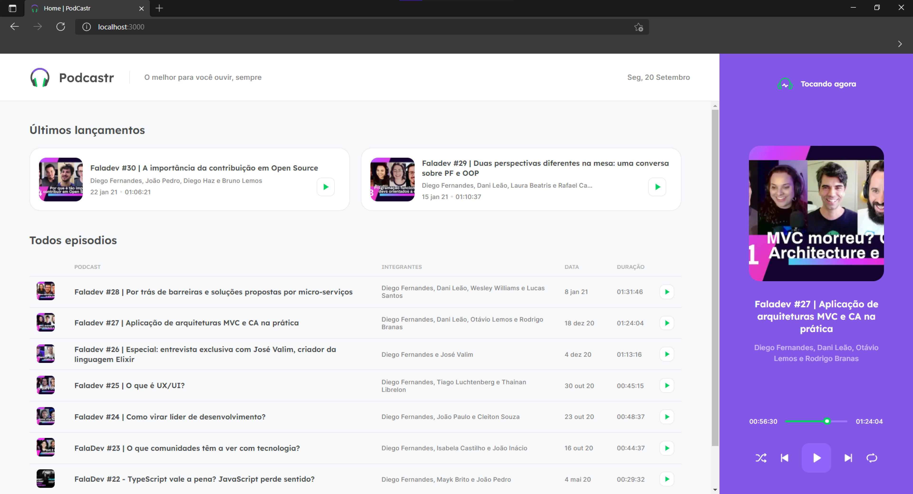

<div align="center">

<h6>Um projeto NLW06<h6/>
</div>



## Techs
* [Typescript](https://www.typescriptlang.org/)
* [ReactJS](https://pt-br.reactjs.org/)
* [Sass](https://sass-lang.com/)
* [NextJS](https://nextjs.org/)

## Run

```
# Clone o projeto
git clone https://github.com/FilipeDiasLima/PodCastr-NLW05.git
```

```
# Instale as libs
yarn

# Rode o web-server
yarn dev

# Rode o back-server
yarn server
```

## Obrigado
:D
